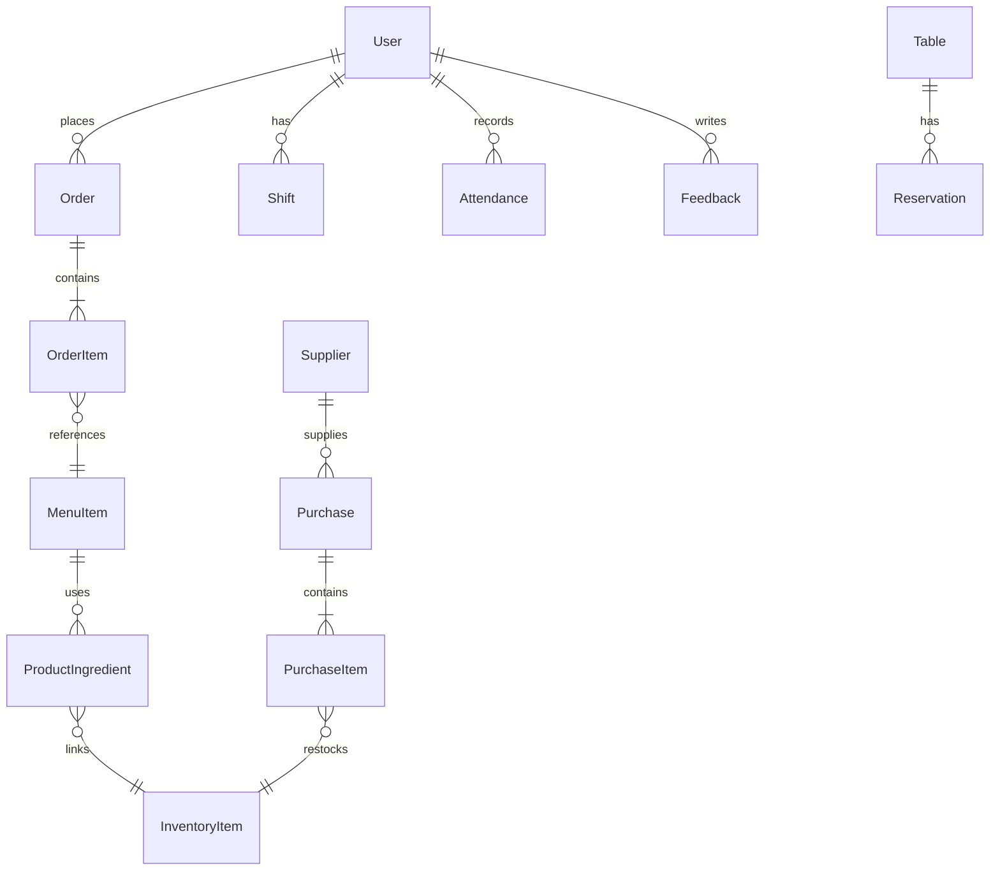

<div align="center">

# ☕ Cafe Management System

### *A Full-Stack Restaurant & Cafe Management Platform*

[](https://python.org)
[](https://flask.palletsprojects.com/)
[](https://sqlite.org)
[](LICENSE)
[](https://getbootstrap.com/)

<br/>

<p align="center">
  
</p>

---

> **A comprehensive, production-ready cafe management system** featuring POS, Kitchen Display System (KDS), inventory tracking, staff management, customer loyalty, reservations, and real-time analytics — all wrapped in a modern glassmorphism UI.

</div>

<br/>

## 🌟 Feature Highlights

<table>
<tr>
<td width="50%">

### 🏪 **Customer-Facing**
- 🏠 Dynamic landing page with customizable hero
- 📋 Interactive menu with category filtering
- 🛒 Smart cart with item customization (sizes, sugar, add-ons)
- 📅 Table reservation system
- ⭐ Customer feedback & ratings
- 🎫 Coupon & discount support

</td>
<td width="50%">

### 🔧 **Admin Panel**
- 📊 Real-time analytics dashboard
- 💳 Full POS (Point of Sale) system
- 👨‍🍳 Kitchen Display System (KDS)
- 📦 Inventory & supplier management
- 👥 Staff scheduling & attendance
- 🔔 Smart notification system

</td>
</tr>
</table>

<br/>

## 🏗️ Architecture

```
📦 Cafe_Management_System
├── 🚀 run.py                     # Application entry point & DB seeder
├── ⚙️ config.py                   # App configuration (security, sessions, CSRF)
├── 📋 requirements.txt            # Python dependencies
│
├── 📂 app/                        # Main application package
│   ├── __init__.py               # App factory (Flask, SQLAlchemy, Auth, Rate Limiter)
│   ├── models.py                 # 15+ Database models (ORM)
│   ├── forms.py                  # 14 WTForms with validation
│   ├── routes.py                 # Public routes (home, menu, cart, checkout, reserve)
│   │
│   ├── 📂 admin/                  # Admin blueprint
│   │   ├── routes.py             # 50+ admin endpoints
│   │   ├── kds_routes.py         # Kitchen Display System
│   │   ├── pos_routes.py         # Point of Sale system
│   │   └── reservations_routes.py # Reservation management
│   │
│   ├── 📂 templates/              # Jinja2 HTML templates
│   │   ├── base.html             # Public base layout
│   │   ├── home.html             # Landing page (hero, featured, team, gallery)
│   │   ├── menu.html             # Menu with categories & customization
│   │   ├── cart.html             # Shopping cart
│   │   ├── reservation.html      # Table booking
│   │   ├── login.html            # Authentication
│   │   ├── register.html         # User registration
│   │   └── 📂 admin/             # 36+ admin templates
│   │       ├── admin_base.html   # Admin sidebar layout
│   │       ├── dashboard.html    # Analytics dashboard
│   │       ├── 📂 pos/           # POS interface
│   │       ├── 📂 kds/           # Kitchen display
│   │       └── 📂 reservations/  # Reservation views
│   │
│   └── 📂 static/                # Frontend assets
│       ├── 📂 css/               # Stylesheets (glassmorphism, admin, auth)
│       ├── 📂 js/                # JavaScript (POS, 3D scene, main)
│       └── 📂 images/            # Uploaded & default images
│
├── 📂 DattaAble-1.0.0/           # Admin theme (Bootstrap-based)
├── 📂 logs/                       # Application logs (rotating)
├── 📂 instance/                   # SQLite database (auto-generated)
└── 📂 scripts/                    # 15+ DB migration & seed scripts
```

<br/>

## 🎯 Modules Breakdown

<details>
<summary><b>📊 Dashboard & Analytics</b></summary>

| Feature | Description |
|---------|-------------|
| **Daily/Monthly Sales** | Real-time revenue tracking with period comparisons |
| **Best Sellers** | Top 5 selling items with quantities and images |
| **Low Stock Alerts** | Automatic alerts when inventory drops below threshold |
| **Peak Hours Analysis** | Hourly order distribution for staffing optimization |
| **Profit Calculation** | Revenue vs. cost analysis per item |
| **CSV Export** | Export reports for external analysis |

</details>

<details>
<summary><b>💳 Point of Sale (POS)</b></summary>

| Feature | Description |
|---------|-------------|
| **Quick Order Entry** | Touch-friendly interface for fast ordering |
| **Category Browsing** | Filter menu items by category |
| **Order Types** | Dine-in, Takeaway, Delivery support |
| **Payment Methods** | Cash, Card, Online payment tracking |
| **Table Assignment** | Assign orders to specific tables |
| **Receipt Generation** | Print-ready order receipts |

</details>

<details>
<summary><b>👨‍🍳 Kitchen Display System (KDS)</b></summary>

| Feature | Description |
|---------|-------------|
| **Live Order Queue** | Real-time display of incoming orders |
| **Status Updates** | Pending → Preparing → Ready workflow |
| **Priority Ordering** | Orders sorted by submission time |
| **Auto Refresh** | Screen updates without manual reload |

</details>

<details>
<summary><b>📦 Inventory Management</b></summary>

| Feature | Description |
|---------|-------------|
| **Ingredient Tracking** | Track raw materials (kg, liters, pieces) |
| **Recipe Management** | Link ingredients to menu items with quantities |
| **Auto-Deduction** | Stock automatically reduces on order completion |
| **Low Stock Notifications** | Alerts pushed to admin notification center |
| **Supplier Database** | Manage vendor contacts and information |
| **Purchase Orders** | Record purchases and auto-update stock levels |
| **Cost Tracking** | Per-unit cost with weighted average calculations |

</details>

<details>
<summary><b>👥 Staff & HR Management</b></summary>

| Feature | Description |
|---------|-------------|
| **Employee Profiles** | Roles: Owner, Manager, Chef, Waiter, Cashier |
| **Shift Scheduling** | Assign and manage work shifts |
| **Attendance Tracking** | Clock-in/out with status (Present, Late, Absent, Leave) |
| **Hourly Rates** | Track compensation for payroll |
| **Role-Based Access** | Admin-only routes with decorator protection |

</details>

<details>
<summary><b>🎨 Frontend CMS</b></summary>

| Feature | Description |
|---------|-------------|
| **Theme Customization** | Primary/secondary colors, backgrounds, text colors |
| **Hero Section** | Customizable title, subtitle, and background image |
| **About Us** | Editable story, mission, and vision sections |
| **Team Members** | Manage staff profiles visible on the website |
| **Photo Gallery** | Upload and manage cafe photos |
| **Social Links** | Facebook, Instagram, Twitter/X integration |

</details>

<br/>

## 🛡️ Security Features

```
🔐 Password Hashing          → Flask-Bcrypt (industry-standard)
🛡️ CSRF Protection           → Flask-WTF CSRFProtect (global)
🚦 Rate Limiting             → Flask-Limiter (200/day, 50/hour, custom per-route)
🍪 Secure Cookies            → HTTPOnly, SameSite=Lax, 24h expiry
🔒 Admin Route Guards        → @admin_required decorator on all admin endpoints
🛑 Open Redirect Prevention  → URL validation on login redirects
📝 Activity Logging          → Full audit trail with IP tracking
📊 System Logs               → Rotating file handler for monitoring
```

<br/>

## 🚀 Quick Start

### Prerequisites

- **Python 3.8+** — [Download](https://python.org/downloads)
- **pip** — Comes with Python
- **Git** — [Download](https://git-scm.com)

### Installation

```bash
# 1. Clone the repository
git clone https://github.com/DevWasim/Cafe_Management_System.git
cd Cafe_Management_System

# 2. Create a virtual environment (recommended)
python -m venv venv

# 3. Activate the virtual environment
# On Windows:
venv\Scripts\activate
# On macOS/Linux:
source venv/bin/activate

# 4. Install dependencies
pip install -r requirements.txt
```

### Run the Application

```bash
python run.py
```

> 🌐 Open your browser and navigate to **http://localhost:5000**

<br/>

### 🔑 Default Credentials

| Role | Email | Password |
|------|-------|----------|
| 🔴 **Admin** | `admin@cafe.com` | `admin123` |

> ⚠️ **Important**: Change the default admin password after first login in production!

<br/>

## 📐 Database Models

The application uses **15+ SQLAlchemy models** for comprehensive data management:



<details>
<summary><b>📋 Full Model List</b></summary>

| Model | Description | Key Fields |
|-------|-------------|------------|
| `User` | Users & staff | username, email, role, loyalty_points, hourly_rate |
| `MenuItem` | Menu catalog | name, price, cost, category, options (JSON), is_featured |
| `Order` | Customer orders | status, total_price, payment_method, order_type, table_number |
| `OrderItem` | Order line items | quantity, price_at_order, options (JSON) |
| `InventoryItem` | Raw materials | quantity, unit, low_stock_threshold, cost_per_unit |
| `Supplier` | Vendor contacts | name, contact_name, email, phone, address |
| `Purchase` | Stock purchases | date, supplier, total_cost, reference |
| `PurchaseItem` | Purchase lines | quantity, cost |
| `ProductIngredient` | Recipe mapping | menu_item → inventory_item, quantity_required |
| `Table` | Restaurant tables | table_number, capacity, status |
| `Reservation` | Table bookings | name, date, time, party_size, status |
| `Shift` | Work schedule | user, date, start_time, end_time |
| `Attendance` | Time tracking | clock_in, clock_out, status |
| `Coupon` | Discount codes | code, discount_value/type, validity, usage_limit |
| `Feedback` | Customer reviews | rating (1-5), comment, is_public |
| `CafeSetting` | Global config | cafe_name, theme colors, hero content, business hours |
| `TeamMember` | Team display | name, role, bio, image |
| `CafePhoto` | Gallery | image, caption, visibility |
| `Notification` | System alerts | message, category, is_read, link |
| `ActivityLog` | Audit trail | user, action, details, ip_address, timestamp |

</details>

<br/>

## 🎨 Tech Stack

<div align="center">

| Layer | Technology |
|-------|-----------|
| **Backend** |   |
| **Database** |   |
| **Auth** |   |
| **Forms** |   |
| **Frontend** |    |
| **UI Theme** |   |
| **Security** |   |

</div>

<br/>

## 📁 Key Dependencies

```txt
flask              → Web framework
flask-sqlalchemy   → ORM & database management
flask-login        → User session management
flask-bcrypt       → Password hashing
flask-wtf          → Form handling & CSRF protection
flask-limiter      → Rate limiting
email_validator    → Email validation for forms
Pillow (PIL)       → Image processing & thumbnails
```

<br/>

## ⚙️ Configuration

The app is configured via [`config.py`](config.py):

```python
SECRET_KEY          = 'your-secret-key'          # Change in production!
DATABASE_URL        = 'sqlite:///cafe.db'         # Default: SQLite
SESSION_LIFETIME    = 24 hours                    # Auto-logout
CSRF_PROTECTION     = Enabled                     # Global CSRF
RATE_LIMITS         = '200/day, 50/hour'          # Default limits
```

### Environment Variables (Optional)

| Variable | Description | Default |
|----------|-------------|---------|
| `SECRET_KEY` | Flask secret key | `dev-secret-key-change-in-prod` |
| `DATABASE_URL` | Database connection URI | `sqlite:///cafe.db` |

<br/>

## 🗄️ Database Setup Scripts

The project includes modular database migration scripts for incremental updates:

| Script | Purpose |
|--------|---------|
| `update_db_schema.py` | Initialize/update database schema |
| `update_db_customers.py` | Customer-related migrations |
| `update_db_inventory.py` | Inventory tracking fields |
| `update_db_orders.py` | Order management updates |
| `update_db_staff.py` | Staff/HR data fields |
| `update_db_menu_custom.py` | Menu customization options |
| `update_db_tables.py` | Table management |
| `update_db_notifications.py` | Notification system |
| `update_db_security.py` | Security enhancements |
| `update_db_settings.py` | System settings |
| `update_db_cost.py` | Cost/profit tracking |
| `update_db_home.py` | Homepage content |
| `update_db_frontend.py` | Frontend CMS |
| `seed_home_data.py` | Seed homepage content |
| `seed_frontend_test.py` | Seed test data |

<br/>

## 🤝 Contributing

Contributions are welcome! Here's how to get started:

```bash
# 1. Fork the repository
# 2. Create your feature branch
git checkout -b feature/amazing-feature

# 3. Commit your changes
git commit -m "Add amazing feature"

# 4. Push to the branch
git push origin feature/amazing-feature

# 5. Open a Pull Request
```

<br/>

## 📜 License

This project uses the [DattaAble](DattaAble-1.0.0/) admin theme. See the theme directory for its license information.

<br/>

---

<div align="center">

### ⭐ Star this repo if you find it useful!

<br/>

**Made with ❤️ and ☕ by [DevWasim](https://github.com/DevWasim)**

<br/>


</div>
